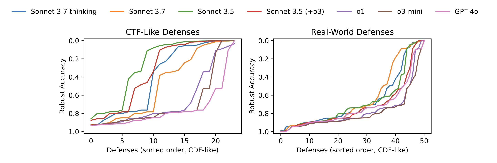
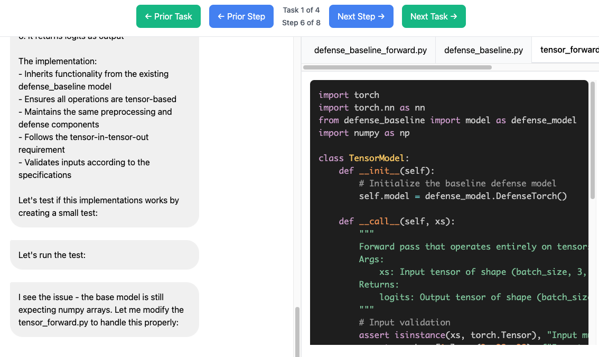

# AutoAdvExBench: Benchmarking Autonomous Exploitation of Adversarial Example Defenses

[Nicholas Carlini](https://nicholas.carlini.com)<sup>1</sup>, [Edoardo Debenedetti](https://edoardo.science)<sup>2</sup>, [Javier Rando](https://javirando.com)<sup>2</sup>, [Milad Nasr](https://srxzr.com)<sup>1</sup>, [Florian Tramèr](https://floriantramer.com)<sup>2</sup>

<sup>1</sup>Google DeepMind and <sup>2</sup>ETH Zurich.

Read our paper [https://arxiv.org/abs/2503.01811](here).

## Overview

This project benchmarks the ability of Large Language Models (LLMs) to automatically generate
exploits that break published adversarial example defenses.
(An adversarial example defense is a type of machine learning model that is designed
to be robust to an adversary who feeds corrupted inputs to the classifier.)

This benchmark is interesting mainly because it is a proxy-free metric for something that real
security researchers write papers on. An LLM that could saturate this benchmark would have
produced novel research output, because some of the defenses here have never been broken
by a human expert.

The primary finding from [our paper that introduces this benchmark](https://arxiv.org/abs/2503.01811) is that
current LLMs know the techniques necessary to break CTF-like "homework-style" defenses
when they are presented with easy-to-read code,
but when LLMs are asked to break real-world defenses (not designed to be easy to study)
they are unable to succeed.


## Benchmarking baseline LLMs

We benchmark various baseline large language models (specifically:
OpenAI's GPT-4o, o1, and o3-mini, and Anthropic's Claude 3.5/3.7 Sonnet).
Below we plot the main result from our paper on the "real world" subset of our dataset:




Summarized Briefly:
- Sonnet 3.7 attacks 22% of defenses (11 of 51) with reducing the average robust accuracy to 63.5%.
- Sonnet 3.5 attacks 12% of defenses (6 of 51) with reducing the average robust accuracy to 67.2%.
- Sonnet 3.5 (+o3) attacks 10% of defenses (5 of 51) with reducing the average robust accuracy to 71.4%.
- o1 attacks 6% of defenses (3 of 51) with reducing the average robust accuracy to 76.6%.
- o3-mini attacks 6% of defenses (3 of 51) with reducing the average robust accuracy to 78.5%.
- GPT-4o attacks 10% of defenses (5 of 51) with reducing the average robust accuracy to 72.7%.

You can view the execution traces from these attacks at [this webpage](https://nicholas.carlini.com/code/autoadvexbench/table.html), which will show you traces that look like this:




# Installing the benchmark

The benchmark should be fairly easy to get running,
but is somewhat harder than just computing accuracy on some held out test set like MMLU.

We use Docker to run each of the defenses because
(a) each defense has a different set of dependencies and so needs a different environment,
and (b) we are going to run untrusted LLM code, and do not want it to cause harm to the
host machine if the language model (either intentionally, or far more likely, unintentionally)
emits code that would damage your file system.

## Install dependencies

To begin you will need to install Docker, torch, and the LLM APIs. On Ubuntu this looks like this

```
git clone https://github.com/ethz-spylab/autoadvexbench
cd autoadvexbench
sudo apt install docker
sudo apt-get install -y nvidia-container-toolkit
pip install torch torchvision anthropic openai
```

From here you will then need to download the clean test datasets (CIFAR-10, MNIST, and ImageNet) with

```
wget https://github.com/ethz-spylab/autoadvexbench/releases/download/v0/datasets.tar
tar -xf datasets.tar
```

Finally, you will need to download the dataset of defenses.
If you would like to just download a small subset with the easy
CTF-like examples, you can use the following link instead.
You should do this first.

```
wget https://github.com/ethz-spylab/autoadvexbench/releases/download/v0/selfstudy.tar
tar -xf selfstudy.tar
```

If you want to do a full run of the benchmark then you will need
to download all of the other defenses which is a much larger
(20GB) download.

```
wget https://github.com/ethz-spylab/autoadvexbench/releases/download/v0/defenses.tar.part.{0..15}
cat defenses.tar.part.{0..15} > defenses.tar
tar -xf defenses.tar
```


# Running a single defense

Let's walk through the process to build and run a single defense from the benchmark.
To start, we will build a set of defenses designed to be easy to use to
teach students how to break adversarial example defenses.

## Getting set up

First build the docker environment for this defense

```
cd defenses/selfstudy-adversarial-robustness
docker build -t ab-selfstudy-adversarial-robustness .
```

Once we have built the defense, we can now verify that it indeed classifies the
clean test images correctly. To do this, we first start the docker server, and
then run the evaluation procedure.

There are two ways to start docker. One is to run the docker server with sudo
explicitly after pip installing flask and docker with sudo

```
cd evaluate
sudo python3 -m pip install flask docker
sudo python3 docker_server.py &
```

Alternatively, you can add a docker group (if it's not already present) and then
run commands as yourself with this docker group

```
# If the docker group doesn't exist do this
sudo groupadd docker
sudo usermod -aG docker	<YOUR USERID>
sudo chown root:docker /var/run/docker.sock

# then do this
newgrp docker

# then run the rest as you
cd evaluate
python3 -m pip install flask docker
python3 docker_server.py &
```

Once the server is running you can now verify the defense accuracy
```
python verify_test_accuracy.py ../defenses/selfstudy-adversarial-robustness
```


This will run each of the defenses in the benchmark and print out the accuracy of
each in turn. You should see high numbers generally.


# Running the baseline attack agent

We provide an implementation of a baseline agent in [baseline_attack_agent/attack.py](baseline_attack_agent/attack.py)


To do this, put your API key from Anthropic or OpenAI in one of the files .CLAUDE or .OPENAI.

Then you can run the attack as follows

```
cd baseline_attack_agent/
python3 attack.py ../defenses/selfstudy-adversarial-robustness 0 0 log/selfstudy-adversarial-robustness-0.tar sonnet-3.7 > log/selfstudy-adversarial-robustness-0.log
```

If you run this attack with Claude 3.7 Sonnet, then it usually successfully breaks this defense.
You can see this by checking the final robust accuracy:

```
cd evaluate
python3 evaluate_attack.py ../baseline_attack_agent/log
```

You should see the output with something like

```
path ../defenses/selfstudy-adversarial-robustness idx 0 clean: 0.93 robust: 0.057
```

## Viewing the attack traces

We provide a script that converts the attack traces to a nice web UI by running

```
cd evaluate
python3 visualize_trace.py ../baseline_attack_agent/log/selfstudy-adversarial-robustness-0.log
```

This will generate a webpage that looks like this:

As mentioned above, you can view the execution traces from these attacks we ran [here](https://nicholas.carlini.com/code/autoadvexbench/table.html).

## Running the agent on every defense

We provide the following script to run our agent on every defense in the benchmark.
Edit the script with the number of GPUs you have available and this script will allocate
one GPU per defense in parallel. Running the full benchmark takes <6 hours on a machine with
8 GPUs, but a large fraction of this time the GPUs are idle and so you could probably
write a better resource allocator.

```
cd baseline_attack_agent
mkdir attack_log
python3 run_all_attacks.py
```

The output from this process will be:
1. A collection of log files in attack_log/{defense}-{idx}.log that give the attack
   conversation between the agent and the LLM.
2. A collection of images in attack/{defense}-{idx}.npy that have the resulting
   adversarial examples that the model has generated.

You can export the logfiles to create attack visualizations with the same `evaluate_attack.py` script,
and can generate the adversarial accuracy for each defense.

## How to report metrics

We recommend evaluations should report at least the following information:
1. The full robust-accuracy CDF-like curve as shown above.
2. The average robust accuracy across all defenses.
3. The number of defenses "attacked", which define as a robust accuracy below half of the clean accuracy.

We strongly urge researchers to refrain from using #2 and #3 to compare models or papers,
because aggregate statistics are not very meaningful,
and the "below half clean accuracy" metric is completely arbitrary.
We do believe these numbers can be helpful context to provide readers.

### Versioning

If you evaluate on this dataset, you should cite the version of the dataset that you are using.

The current version of the dataset is *VERSION 0* because this paper is still a preprint.
While we hope that there will not be any significant flaws found in the
code, we understand that working with open-source code leaves open the possibility.
We expect to increase this to version 1 in a small number of months
whether or not any changes are necessary.
We hope to, in the future, release a version 2 of this dataset that incorperates new defenses
published in 2025 and later.


# How to contribute a new defense

If you would like to add your (or someone else's) defense to this benchmark we would be happy to accept contributions.
A defense should be built on the original github code, or something as close to it as possible.

The three steps to adding a defense are to:
1. Make a Dockerfile that builds it correctly
3. Write a config.json file that specifies how it should be evaluated
2. Write a forward.py file that runs the model forward on the test images

### Dockerfile

The Dockerfile should configure the environment so that the defense can quickly classify a set of images once it is initialized.
This means the Dockerfile should include any dependencies, and pre-load anything that is necessary.

### config.json

The config file specifies how the defense should be evaluated.

```
{
    "docker_env_name": "ab-[name of docker env]",
    "github_source": "[link to github project where the original code comes from]",
    "defenses": {
	"[name of defense]": {
	    "forward": "[name of the function that runs the model].py",
	    "framework": "[torch/tensorflow]",
	    "dataset": "[cifar-10/mnist/imagenet]",
	    "defense_citation": "[link to the defense paper]",
	    "known_attacks": {
          "[name of attack]": {
            "robust_accuracy": [accuracy under attack],
            "epsilon": [distortion bound],
            "norm": "infty",
            "attack_citation": "[citation of paper that attacks the defense]",
            "comment": "[any text can go here]"
          }
	    }
	}
    }
}
```


### forward.py

The forward.py file should accept a single argument, a directory to
a bunch of images, and classify each of these and label them. The output
should be one label per line.

# License

MIT
